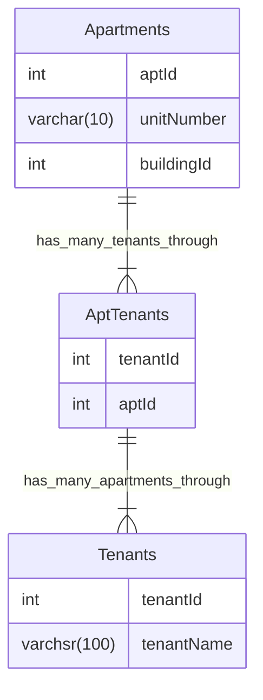

# title

## Purpose

Learning MySQL is valuable because it equips you with the essential skills to efficiently manage and manipulate relational databases, empowering you to handle data effectively in a wide range of applications and industries.

## Concept

### Init

* Install: `brew install mysql`
* Start: `brew services start mysql`
* Open console: `mysql -u root -p` and then enter password

### Database

* Create: `CREATE DATABASE desired_database_name`
* Read
  * Databases: `SHOW DATABASES;`
  * Specific database: `USE database_name;`
* Update
  * rename database
    ```mysql
    -- 1. Backup the Database
    -- 2. Run SQL Query
    RENAME DATABASE old_name TO new_name;
    ```
* Destroy: `drop database <db_name>;`

### Table

* Create: `CREATE TABLE desired_table_name ...`
  * Example:
    ```bash
    CREATE TABLE users(id INT(11) AUTO_INCREMENT PRIMARY KEY, name VARCHAR(100), email VARCHAR(100), username VARCHAR(30), password VARCHAR(100), register_date TIMESTAMP DEFAULT CURRENT_TIMESTAMP);
    ```
* Read: `SHOW TABLES;`
* Update
  * rename table: `RENAME TABLE tb1 TO tb2;`
  * transfer table: `CREATE TABLE destination_db.my_table SELECT * FROM source_db.my_table;`
* Destroy: `DROP TABLE "TABLE_NAME";`

### Row

* Create: `INSERT INTO table_name(attributes...) VALUES(values...)`
* Read
  * All rows: `SELECT * FROM table_name;`
  * Specific condition: `SELECT * FROM table_name where xxx`
  * Specific column: `SELECT xxx FROM table_name`
* Update
  ```mysql
  UPDATE table_name
  SET column1 = value1, column2 = value2, ...
  WHERE condition;
  ```
* Destroy: `DELETE FROM ‘table_name’ WHERE (condition)`

### Data type

#### Numeric

* exact
  * INTEGER
  * SMALLINT
  * DECIMAL
  * NUMERIC
* approximate
  * FLOAT
  * REAL
  * DOUBLE PRECISION

#### Time

* DATE
* TIME
* DATETIME
* TIMESTAMP
* YEAR

#### String

* CHAR
* VARCHAR
* BINARY
* VARBINARY
* BLOB
* TEXT
* ENUM
* SET

#### Spatial

* 

#### JSON

#### Default Value

You can explicitly specify the default value for the new created record; for example,
```mysql
CREATE TABLE t1 (
  -- literal defaults
  i INT         DEFAULT 0,
  c VARCHAR(10) DEFAULT '',
  -- expression defaults
  f FLOAT       DEFAULT (RAND() * RAND()),
  b BINARY(16)  DEFAULT (UUID_TO_BIN(UUID())),
  d DATE        DEFAULT (CURRENT_DATE + INTERVAL 1 YEAR),
  p POINT       DEFAULT (Point(0,0)),
  j JSON        DEFAULT (JSON_ARRAY())
);
```

### Syntax

#### GROUP BY & HAVING

```SQL
SELECT column1, column2, aggregate_function(column3)
FROM table_name
GROUP BY column1, column2
HAVING aggregate_function(column3) condition;
```

The concept of GROUP BY is to group the rows according to the values of the columns. After we have the GROUP BY, we can then use aggregate_function to manipulate the data of these groups; for example, sum(column3) will return sum of the value of the column3 on each group with specific value of column1 and column2.

## Example

### Multiple Apartments



* Question: Write a SQL query to get a list of tenants who are renting more than one apartment.
* Code:
  ```MySQL
  SELECT Tenants.tenantName FROM Tenants joins AptTenants on Tenants.tenantId = AptTenants.tenantId GROUP BY Tenants.tenantId HAVING COUNT(AptTenants.aptId) > 1
  ```

### insert csv

* Create table with same column names of csv file
  ```bash
  CREATE TABLE Nikkei_225 (
    id INT NOT NULL AUTO_INCREMENT,
    Date DATE NOT NULL, 
    Open DECIMAL(19, 4),
    High DECIMAL(19, 4),
    Low DECIMAL(19, 4),
    Close DECIMAL(19, 4), 
    Adj_Close DECIMAL(19, 4),
    PRIMARY KEY (id)
  );
  ```
* Load csv data
  ```bash
  LOAD DATA INFILE '/private/tmp/C.csv'
    INTO TABLE Nikkei_225
    FIELDS TERMINATED BY ','
    ENCLOSED BY '"'
    LINES TERMINATED BY '\n'
    IGNORE 1 ROWS;
  ```
  * `FIELDS TERMINATED BY ','` means the method to separate each data in a row is by `,`
  * `ENCLOSED BY '"'` means each data is warped by `"`
  * `LINES TERMINATED BY '\n'` means the separating method between each line is \n, the regular expression representing change line
  * `IGNORE 1 ROWS` means the process during import csv file will ignore the column names whose location is on first row

## Reference

[data type](https://dev.mysql.com/doc/refman/8.0/en/data-types.html#:~:text=MySQL%20supports%20SQL%20data%20types,and%20the%20JSON%20data%20type.)
