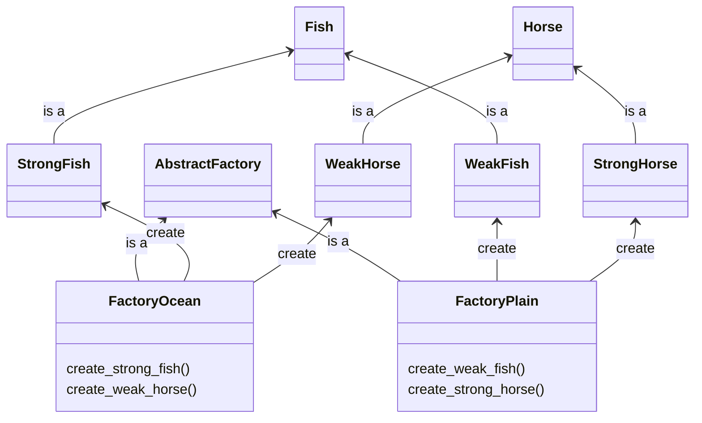

# Title

## Purpose

Abstract factory is the extension of factory method. Use the abstract factory pattern when you need to create families of related objects and ensure their compatibility, whereas the factory method pattern is suitable for creating individual objects with customization.

## Concept

Recap: We call the factory method to create **same** kind of product but choose **different** feature during the process of production.

If we want the factory to create various product, we need the factory to have various product lines, which is the abstract factory design pattern.

For example, let's say we want two environments, ocean and plain and two types of monsters, horse and fish. The horse monster is strong in plain but weak in ocean; the fish monster is strong in ocean but weak in plain. We need two factories for two environments. Each has two product lines.

so the methods to create the monsters accroding to the envrionmnets would be as follow:

```ruby
def create_monsters(FactoryOcean.new)
end

def create_monsters(FactoryPlain.new)
end
```

and the UML would be as follow:



## Example

```ruby
class AbstractFactory
  def create_fish
    raise NotImplementedError, "#{self.class} has not implemented method '#{__method__}'"
  end

  def create_horse
    raise NotImplementedError, "#{self.class} has not implemented method '#{__method__}'"
  end
end

class FactoryOcean < AbstractFactory
  def create_fish
    StrongFish.new
  end

  def create_horse
    WeakFish.new
  end
end

class FactoryPlain < AbstractFactory
  def create_fish
    WeakFish.new
  end

  def create_horse
    StrongHorse.new
  end
end

class Fish
  def power
    raise NotImplementedError, "#{self.class} has not implemented method '#{__method__}'"
  end
end

class StrongFish < Fish
  def power
    'strong fish'
  end
end

class WeakFish < Fish
  def power
    'weak fish'
  end
end

class Horse
  def power
    raise NotImplementedError, "#{self.class} has not implemented method '#{__method__}'"
  end
end

class StrongHorse < Horse
  def power
    'strong horse'
  end
end

class WeakHorse < Horse
  def power
    'weak horse'
  end
end

def create_monsters(factory)
  fish = factory.create_fish
  horse = factory.create_horse

  puts fish.power
  puts horse.power
end

create_monsters(FactoryOcean.new)
create_monsters(FactoryPlain.new)
```

## Reference

[Abstract Factory Pattern – Design Patterns (ep 5)](https://www.youtube.com/watch?v=v-GiuMmsXj4&list=PLrhzvIcii6GNjpARdnO4ueTUAVR9eMBpc&index=5)
