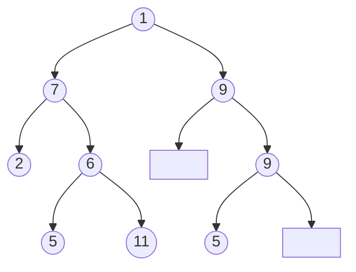

# Title

## Purpose

Learning tree data structures is essential for organizing and efficiently accessing hierarchical data, such as file systems, organizational structures, and decision-making processes.

## Concept

### types of tree

* General tree: each node has 0 to many child node
  ```mermaid
  graph TD
    id1((A)) --> id2((B))
    id1((A)) --> id3((C))
    id1((A)) --> id4((D))
    id1((A)) --> id5((E))
  
    id2((B)) --> id6((F))
    id3((C)) --> id7((G))
    id3((C)) --> id8((H))
    id5((E)) --> id9((I))
  
    id8((H)) --> id10((J))
  ```
* Binary tree: each node has at most 2 child modes
  ```mermaid
  graph TD
    id1((1)) --> id2((7))
    id1((1)) --> id3((9))
  
    id2((7)) --> id4((2))
    id2((7)) --> id5((6))
    id3((9)) --> STOP1[ ]
    id3((9)) --> id6((9))
  
    id5((6)) --> id7((5))
    id5((6)) --> id8((11))
  
    id6((9)) --> id9((5))
    id6((9)) --> STOP2[ ]
  ```
  * The rectangle means no data
  * Type
    * Self-balancing: Balance means that the tree remains relatively symmetric and prevents it from becoming skewed or heavily imbalanced.
    * Complete: Complete means that except last level, all levels' node has 0 or 2 children.
    * Full: Full means every node has 0 or 2 children.
    * Perfect: Perfect means all nodes have two children and all leaves are at the same level

### types of traversal

Given a tree as follow: (The rectangle means no data)



There are three actions we can do in current node

* Visit (return the value of current node)
* Left (traverse to the left node)
* Right (traverse to the right node)

After each traverse, redo it from begin

* Inorder traversals (L > V > R): traverse(1) -> [traverse(7), push(1), traverse(9)] -> [traverse(2), push(7), traverse(6)], push(1), [null, push(9), traverse(9)] -> ... -> 2 -> 7 -> 5 -> 6 -> 11 -> 1 -> 9 -> 5 -> 9
* Preorder traversals (V > L > R): traverse(1) -> [push(1), traverse(7), traverse(9)] -> [push(1), push(7), traverse(2), traverse(6), push(9), traverse(null), traverse(9)] -> ... ->  1 -> 7 -> 2 -> 6 -> 5 -> 11 -> 9 -> 9 -> 5
* Postorder traversals (L > R > V): traverse(1) -> [traverse(7), traverse(9), push(1)] -> [traverse(2), traverse(6), push(7), traverse(null), traverse(9), push(9), push(1)] -> ... -> 2 -> 5 -> 11 -> 6 -> 7 -> 5 -> 9 -> 9 -> 1

### Essential Structure

* Tree:
  ```javascript
  class Tree {
    constructor(key, value) {
      this.root = null; // will use insert to create this root
    }
  
    traversal(node = this.root) {
    }
  
    insert() { // we can only insert node as leaf
    }
  
    remove() {
    }
  
    find() {
    }
  }
  
  class TreeNode {
    constructor(key, value = key, parent = null) {
      this.key = key;
      this.value = value;
      this.parent = parent;
      this.children = [];
    }
  
    get isLeaf() {
    }
  
    get hasChildren() {
    }
  }
  ```

### Binary Tree

* Diagram (the number of left node is not necessary smaller than the right node)
  ```bash
          a
        /   \
       b     c
      / \   / \
     d   e f   g
  ```
* code example
  ```javascript
  class BinaryTreeNode {
    constructor(key, value = key, parent = null) {
      this.key = key;
      this.value = value;
      this.parent = parent;
      this.left = null;
      this.right = null;
    }
  }
  
  class BinaryTree {
    constructor() {
      this.root = null;
    }
  
    addNode(value) { // will use recursive
      if (this.root === null) {
        this.root = new BinaryTreeNode(value)
      } else {
        this.insertNode(this.root, new BinaryTreeNode(value))
      }
    }
  
    inorderTraversal() { // L > V > R
      const result = [];
  
      function traverse(node) {
        if (node) {
          traverse(node.left);
          result.push(node.value);
          traverse(node.right);
        }
      }
  
      traverse(this.root);
      return result;
    }
  
    preorderTraversal() { // V > L > R
      const result = [];
  
      function traverse(node) {
        if (node) {
          result.push(node.value)
          traverse(node.left);
          traverse(node.right);
        }
      }
  
      traverse(this.root);
      return result
    }
  
    postorderTraversal() { // L > R > V
      const result = [];
  
      function traverse(node) {
        if (node) {
          traverse(node.left);
          traverse(node.right);
          result.push(node.value)
        }
      }
  
      traverse(this.root);
      return result
    }
    
    levelorderTraversal() {
      // [5, 3, 8, 2, 4, 7, 9]
      const queue = [this.root]
      const result = []
  
      if (!this.root) {
        return
      }
  
      while (queue.length > 0) {
        const node = queue.shift()
        result.push(node.value)
  
        if (node.left !== null) {
          queue.push(node.left)
        }
        if (node.right !== null) {
          queue.push(node.right)
        }
      }
  
      return result
    }
  
    insertNode(parentNode, newNode) {
      // there is no specific insertion method for binary tree
    }
  }
  
  module.exports = BinaryTree
  ```

### Binary Search Tree

A Binary Search Tree (BST) is a data structure with nodes containing a value and two pointers to left and right child nodes, facilitating efficient search and insertion by moving left or right based on the comparison of values, with the efficiency depending on the balance of the tree.
* Diagram
  ```bash
          5
        /   \
       3     8
      / \   / \
     2   4 7   9
  ```
  * The value of left node is alway smaller than the value of right node.
* Code example
  ```javascript
  BinaryTree = require('./binary_tree.js')
  Node = require('./binary_tree_node.js')
  
  class BinarySearchTree extends BinaryTree {
    constructor(root) {
      super(root);
    }
  
    // Create
    addNode(value) { // will use recursive
      if (this.root === null) {
        this.root = new Node(value)
      } else {
        this._insertNode(this.root, new Node(value))
      }
    }
  
    // Read
    search(value) {
      result = this._searchNode(value, this.root)
      if (result !== null) {
        return true
      } else {
        return false
      }
    }

    // Update
    updateValue(node, newValue) {
      target = this._searchNode(value, this.root)
      target.value = newValue
    }

    _insertNode(parentNode, newNode) {
      if(newNode.value < parentNode.value){
        if(parentNode.left === null) {
          parentNode.left = newNode;
        } else {
          this.insertNode(parentNode.left, newNode);
        }
      } else {
        if(parentNode.right === null) {
          parentNode.right = newNode;
        } else {
          this.insertNode(parentNode.right, newNode);
        };
      };
    }

    _searchNode(value, node) {
      if (node === null) {
        return null;
      } else if (value < node.value) {
        return this.search(value, node.left);
      } else if (value > node.value) {
        return this.search(value, node.right);
      } else {
        return node;
      }
    }
  }
  
  module.exports = BinarySearchTree
  ```
* Time complexity of CRUD
  * Create a node: O(log n) - O(n)
    * Inserting a new node into a binary tree requires finding the correct position for the new node in the tree. In the worst case, this involves traversing the height of the tree, which has a time complexity of O(log n) for a balanced binary tree and O(n) for an unbalanced binary tree.
  * read: O(log n) - O(n)
    * The number of operation is proportionate to the layer of nodes, so the time complexity is O(log n) in balanced tree and O(n) in unbalanced tree; no matter what the traversal method is.
  * update: O(log n) - O(n)
    * Before updating the value of a node, we need to traverse to the target node, which is proportionate to the layers of tree, so it is O(log n) for balanced tree and O(n) for unbalanced tree.
  * delete: O(log n) to O(n)
    * Deleting a node from a binary tree requires finding the node to be deleted and then rearranging the tree to maintain its properties. In the worst case, this also involves traversing the height of the tree, which has a time complexity of O(log n) for a balanced binary tree and O(n) for an unbalanced binary tree.
* spec (2023/07/02)
  ```javascript
  const BinaryTree = require('../examples/binary_tree.js');
  
  describe('BinaryTree', () => {
  //     10
  //    /  \
  //   5    15
  //  / \   / \
  // 3   7 12  17
    let testTree;
    beforeEach(() => {
      testTree = new BinaryTree();
      testTree.addNode(10);
      testTree.addNode(5);
      testTree.addNode(15);
      testTree.addNode(3);
      testTree.addNode(7);
      testTree.addNode(12);
      testTree.addNode(17);
    });
  
    test('#init', () => {
      expect(testTree.root.value).toBe(10)
      expect(testTree.root.left.value).toBe(5)
      expect(testTree.root.left.left.value).toBe(3)
      expect(testTree.root.left.right.value).toBe(7)
      expect(testTree.root.right.value).toBe(15)
      expect(testTree.root.right.left.value).toBe(12)
      expect(testTree.root.right.right.value).toBe(17)
    })
  
    test('#search', () => {
      expect(testTree.search(10)).toEqual({
        value: 10,
        left: {
          value: 5,
          left: {
            value: 3,
            left: null,
            right: null
          },
          right: {
            value: 7,
            left: null,
            right: null
          }
        },
        right: {
          value: 15,
          left: {
            value: 12,
            left: null,
            right: null
          },
          right: {
            value: 17,
            left: null,
            right: null
          }
        }
      })
    })
  
    test('#inorderTraversal', () => { // L > V > R
      expect(testTree.inorderTraversal()).toEqual([3, 5, 7, 10, 12, 15, 17])
    })
  
    test('#preorderTraversal', () => { // V > L > R
      expect(testTree.preorderTraversal()).toEqual([10, 5, 3, 7, 15, 12, 17])
    })
  
    test('#postorderTraversal', () => { // L > R > V
      expect(testTree.postorderTraversal()).toEqual([3, 7, 5, 12, 17, 15, 10])
    })
  
    test('#levelorderTraversal', () => {
      expect(testTree.levelorderTraversal()).toEqual([10, 5, 15, 3, 7, 12, 17])
    })
  });
  ```

### Height of Binary Tree

Given a binary tree, return the height; for example

* QA
  * example 1
  ```bash
  Input:
       1
      /  \
     2    3
  Output: 2
  ```
  * example 2
  ```bash
  Input:
    2
     \
      1
     /
   3
  Output: 3
  ```
* code example
  ```javascript
  function maxDepth(node) {
    if(node == null) {
      return 0
    }
  
    lDepth = maxDepth(node.left)
    rDepth = maxDepth(node.right)
  
    if(lDepth > rDepth) {
      return lDepth + 1
    } else {
      return rDepth + 1
    }
  }
  
  module.exports = maxDepth
  ```
* spec
  ```javascript
  const Node = require('../examples/binary_tree_node.js')
  const maxDepth = require('../examples/max_depth.js')
  
  describe('MaxDepth', () => {
    let tree
  
    describe('example 1', () => {
      // Input:
      //    1
      //   /  \
      //  2    3
      // Output: 2
      beforeEach(async () => {
        tree = new Node(1)
        tree.left = new Node(2)
        tree.right = new Node(3)
      })
    
      test('#', () => {  
        expect(maxDepth(tree)).toEqual(2)
      })
    })
    
    describe('example 2', () => {
      // Input:
      //   2
      //    \
      //     1
      //    /
      //  3
      // Output: 3
      beforeEach(async () => {
        tree = new Node(2)
        tree.right = new Node(1)
        tree.right.left = new Node(3)
      })
  
      test('#', () => {
        expect(maxDepth(tree)).toEqual(3)
      })
    })
  })
  ```

### Minimal Tree

* Problem: Given a sorted (increasing order) array with unique integer elements, write an algorithm to create a binary search tree with minimal height.
* Information
  * Example: [1, 2, 3, 4, 5, 6]
    ```bash
          1
        /   \
       2     3
      / \   / \
     4   5 6   
    ```
* Time complexity: O(n) since we must need to traverse the nodes once
* Code example:
  ```javascript
  class MinimalTree {
    constructor() {
      this.root = null;
    }
  
    addNode(value, currentNode = this.root) { // will use recursive
      if (this.root === null) {
        this.root = new Node(value)
      } else if (currentNode.left === null) {
        currentNode.left = addNode(value)
      } else {
        currentNode.right = addNode(value)
      }
    }

    height() {
      let result = 0
      currentNode = this.root
      while(currentNode) {
        result += 1
        currentNode = currentNode.left
      }
      return result
    }
  }
  
  module.exports = MinimalTree
  ```
* Spec:
  ```javascript
  describe('minimal tree', () => {
    test('6 elements', () => {
      let testTree = new MinimalTree()
      let currentNode = null
      values = [1, 2, 3, 4, 5, 6]
      values.forEach((value) => {
        testTree.addNode(value);
      })

      expect(testTree.height()).toEqual(3)
    })
  })
  ```

## What?

### real world example

A real world example of implementing a decision tree

```javascript
class DecisionTreeNode {
  constructor(question, yesNode, noNode) {
    this.question = question;
    this.yesNode = yesNode;
    this.noNode = noNode;
  }

  ask() {
    console.log(this.question);
    let answer = prompt("Enter yes or no:");
    if (answer === "yes") {
      if (this.yesNode instanceof DecisionTreeNode) {
        return this.yesNode.ask();
      } else {
        console.log(this.yesNode);
      }
    } else if (answer === "no") {
      if (this.noNode instanceof DecisionTreeNode) {
        return this.noNode.ask();
      } else {
        console.log(this.noNode);
      }
    } else {
      console.log("Invalid input. Please enter yes or no.");
      return this.ask();
    }
  }
}

let root = new DecisionTreeNode(
  "Is it a mammal?",
  new DecisionTreeNode(
    "Does it have fur?",
    new DecisionTreeNode("Is it a cat?", "It's a cat!"),
    new DecisionTreeNode("Is it a whale?", "It's a whale!")
  ),
  new DecisionTreeNode(
    "Does it have feathers?",
    new DecisionTreeNode("Is it a bird?", "It's a bird!"),
    new DecisionTreeNode("Is it a snake?", "It's a snake!")
  )
);

root.ask();
```

Each node has a question, a yesNode branch and a noNode branch. The ask() method of the node prompts the user to answer the question and then follows the appropriate branch based on the answer. If the branch is another DecisionTreeNode, it recursively calls the ask() method on that node. If the branch is a leaf node, it simply returns the corresponding result.

## TODO

* Determine if two trees are identical
* Mirror tree
* Symmetric Tree
* Diameter of tree
* Checked for Balanced tree
* Children Sum Parent
* Check for BST
* Array to BST
* Largest value in each level of binary tree
* Maximum GCD of siblings of a binary tree
* Zigzag Tree Traversal
* Inorder Successor in BST
* Kth Largest Element in a BST

## Reference

cracking the coding interview

[JavaScript Data Structures - Tree](https://www.30secondsofcode.org/articles/s/js-data-structures-tree)

[What's the purpose of an asterisk (*) in ES6 generator functions](https://stackoverflow.com/questions/27778105/whats-the-purpose-of-an-asterisk-in-es6-generator-functions)

[Tree Traversals (Inorder, Preorder and Postorder)](https://www.geeksforgeeks.org/tree-traversals-inorder-preorder-and-postorder/)

[Binary Tree: Traversal(尋訪)](http://alrightchiu.github.io/SecondRound/binary-tree-traversalxun-fang.html#pre)

[Global and instance mode](https://github.com/processing/p5.js/wiki/Global-and-instance-mode)

[Difference between Binary Tree and Binary Search Tree](https://www.geeksforgeeks.org/difference-between-binary-tree-and-binary-search-tree/)

[Top 50 Tree Coding Problems for Interviews](https://www.geeksforgeeks.org/top-50-tree-coding-problems-for-interviews/)

[Is there a difference between perfect, full and complete tree?](https://cs.stackexchange.com/questions/32397/is-there-a-difference-between-perfect-full-and-complete-tree)
