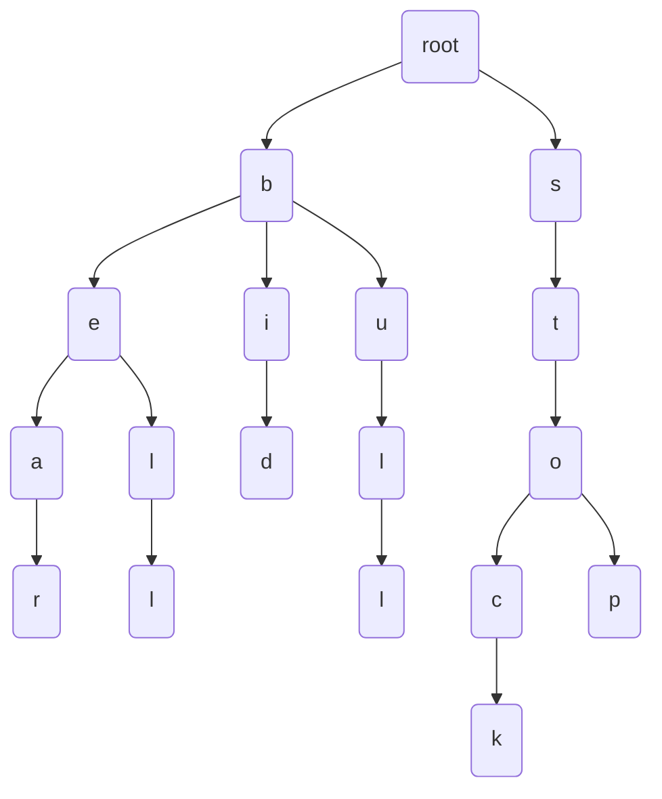

# Title

## Purpose

Tries are a useful data structure for efficiently storing and searching for strings in a large dataset.

## Concept

Suppose we have a set of strings {bear, bell, bid, bull, stock, stop}. We can build a trie for this set of strings as follows:



* code
  ```javascript
  class TrieNode {
    constructor() {
      this.children = {};
      this.isEndOfWord = false;
    }
  }
  
  class Trie {
    constructor() {
      this.root = new TrieNode();
    }
  
    insert(word) {
      let node = this.root;
      for (let i = 0; i < word.length; i++) {
        const char = word[i];
        if (!node.children[char]) {
          node.children[char] = new TrieNode();
        }
        node = node.children[char];
      }
      node.isEndOfWord = true;
    }
  
    search(word) {
      let node = this.root;
      for (let i = 0; i < word.length; i++) {
        const char = word[i];
        if (!node.children[char]) {
          return false;
        }
        node = node.children[char];
      }
      return node.isEndOfWord;
    }
  
    delete(word) {
      let node = this.root
      let nodes = []
      for (let i = 0; i < word.length; i++) {
        const char = word[i]
        if (!node.children[char]) {
          return
        }
        node = node.children[char]
        nodes.push(node)
      }
      if(!node.isEndOfWord) {
        return
      }
      for (let i = nodes.length - 2; i >= 0; i--) {
        if (Object.keys(nodes[i].children).length > 1) {
          continue
        } else {
          delete nodes[i].children[word[i + 1]] // remove the specific children of that character
        }
      }
      node.isEndOfWord = false;
    }
  }
  
  module.exports = Trie
  ```
  * Tries are not design for frequent updates
* Spec
  ```javascript
  const Trie = require('../examples/trie.js')

  describe('Trie', () => {
    let trie = new Trie()
    beforeEach(() => {
      trie.insert('bear')
      trie.insert('bell')
    })
  
    it('should insert words', () => {
      expect(trie.search('bear')).toEqual(true)
      expect(trie.search('bell')).toEqual(true)
    })
  
    it('should delete a word', () => {
      trie.delete('bell')
      expect(trie.search('bell')).toEqual(false)
      expect(trie.search('bear')).toEqual(true)
    })
  })
  ```

## What?

Real world example: Trie for melody

```javascript
class MelodyTrie {
  constructor() {
    this.root = {};
  }

  insert(melody) {
    let node = this.root;
    for (let i = 0; i < melody.length; i++) {
      const note = melody[i];
      node[note] = node[note] || {};
      node = node[note];
    }
    node.isEnd = true;
  }

  search(melody) {
    let node = this.root;
    for (let i = 0; i < melody.length; i++) {
      const note = melody[i];
      if (!node[note]) {
        return false;
      }
      node = node[note];
    }
    return !!node.isEnd;
  }
}

const melodyTrie = new MelodyTrie();

melodyTrie.insert(['C4', 'D4', 'E4']);
melodyTrie.insert(['E4', 'F4', 'G4', 'A4']);
melodyTrie.insert(['G4', 'F4', 'E4', 'D4']);
melodyTrie.insert(['C4', 'C4', 'C4', 'C4']);

console.log(melodyTrie.search(['C4', 'D4', 'E4'])); // true
console.log(melodyTrie.search(['C4', 'D4', 'E4', 'F4'])); // false
```

## Reference
