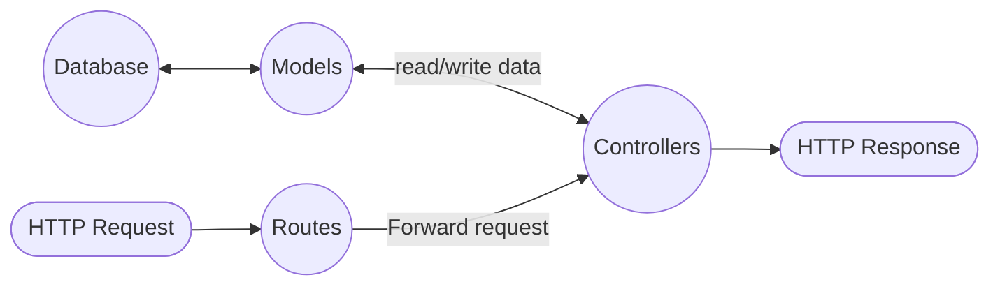

# Title

## Purpose

This article describes the key steps to build application with express, a light-weighted framework based on node. Inherited from node, it features real-time, high-performance, and scalable network. NodeJS is built in javascript.

## Concept

### Init

* Install dependencies
  ```bash
  yarn add express dotenv cors
  yarn add nodemon --save-dev
  ```
  * express: simplifies web development in Node.js by providing a framework for handling HTTP requests, defining routes, implementing middleware, and rendering dynamic views
  * cors: CORS (Cross-Origin Resource Sharing) is primarily enforced by the web browser, which checks the server's response headers to determine if a cross-origin request is permitted based on the requesting domain. This helps prevent unauthorized cross-origin requests and enhances security by ensuring that resources are only accessed by allowed domains.
  * dotenv: allows you to load environment variables from a .env file
  * nodemon: a development utility that automatically restarts the server whenever changes are made to the code
* Initialize
  ```bash
  mkdir my-project
  cd my-project
  yarn init
  ```
* `touch .gitignore` with
  ```bash
  # Dependency directories
  node_modules/
  
  # Optional npm cache directory
  .npm
  
  # dotenv environment variables file
  .env
  ```
* env: In `./.env`, we can add environment variables we want; for example, how to connect development database ...etc
  ```javascript
  process.env.xxx
  ```
* ES6: In `package.json`
  ```JSON
  {
    "type": "module",
    ...
  }
  ```
* Typescript
  * `npx tsc --init`
  * `yarn add ts-node`
  * `yarn add tsconfig-paths`
  * `yarn add express @types/express --save`
  * `npx tsc`
  * Update `package.json`
    ```JSON
    "scripts": {
      "start": "node dist/app.ts",
      "dev": "NODE_ENV=development nodemon ./src/app.ts", // If you use nodemon for development
      "build": "tsc"
    }
    ```
  * Allow ES, in `tsconfig.json`
    ```JSON
    {
      "compilerOptions": {
        "esModuleInterop": true,
      }
    }
    ```
  * Update `nodemon.json`
    ```JSON
    {
      "watch": ["src"],
      "ext": "ts,json",
      "ignore": ["src/**/*.spec.ts"],
      "exec": "node --loader ts-node/esm"
    }
    ```
  * run app through `yarn run dev`
* `touch server.ts` with
  ```javascript
  // init
  import express from 'express'
  const app = express();
  
  if (process.env.NODE_ENV === 'development') {
    app.listen(5000, () => {
      api(app)
    })
  } else if (process.env.NODE_ENV === 'test') {
    app.listen(8080, () => {
      api(app)
    })
  } else {
    // TODO for production
  }
  
  export default app
  ```
* test it with curl: `curl http://localhost:5000/`

### structure

The structure I prefer

* node app
  * test
  * routes
  * controllers
  * configs
  * models
  * database
    * migrations
  * middleware
  * services
  * server.js (core file to start the app)



#### Naming Convention

* File: use hyphens; for example, `user-controller.js`
* Url: use hyphens; for example, `/node-graph`

### Routes

In Express.js, "Routes" are used to direct incoming requests to the appropriate controller functions. These routes are defined based on the HTTP method (like GET or POST) and the URL of the request. Any information encoded in the request URL, such as parameters or query strings, is also forwarded to the controller function.

```js
const express = require('express');
const router = express.Router();
const userController = require('./controllers/user-controller');

// Route for GET request to /users
router.get('/users', userController.getUsers);

// Route for POST request to /users
router.post('/users', userController.createUser);

module.exports = router;
```

### Controllers

"Controller" functions are responsible for handling requests once they've been routed. They interact with the model to get the requested data, create an HTML page (or some other type of response) displaying the data, and send it back to the user to view in their browser.

```js
// In user-controller.js
exports.getUsers = (req, res) => {
  // Get data from model
  // Create HTML page with data
  // Send response to user
};

exports.createUser = (req, res) => {
  // Get data from request
  // Use model to create new user
  // Send response to user
};
```

### Database

[database]({{site.baseurl}}/node/2022/12/30/database.html).

### Model

Various libraries and frameworks such as Mongoose, Sequelize, or Bookshelf can be used to implement models in Node.js, providing an ORM layer for interacting with databases and managing data models. For more information, please refer to [model]({{site.baseurl}}/node/2022/01/20/model.html)

### Service

In Node.js, a service module can be a self-contained piece of code that performs a specific task or set of tasks, such as communicating with an external API, handling database interactions, or performing complex business logic. For more information, please refer to [service]()

### Test

I prefer jest.

* Install
  ```nash
  yarn add jest
  ```
* In `/test`, run jest
  * Setup script, in `package.json`
    ```JSON
    "scripts": {
      "test": "NODE_ENV=test jest",
    },
    ```
* Create spec directory in root, and run tests in specific directory
  ```bash
  npx jest ./tests --detectOpenHandles
  ```
* Environment variables, in `.env` add following to setup test database
  ```bash
  TEST_DATABASE_URL={database_system}://{username}:{password}@{host_and_port}/{database_name}
  ```
* Refer to [Docker] for setting up test database; for example, PG
  ```bash
  docker run --name my_db \
      -e POSTGRESQL_PORT=5432 \
      -e POSTGRESQL_DB=my_db \
      -e POSTGRESQL_USER=postgres \
      -e POSTGRES_PASSWORD=test1234 \
      -d postgres
  ```
* Use `request(app)` to test the api
  ```javascript
  const request = require('supertest')
  const app = require('../server.js')
  const apis = require('../apis/summary.js')
  
  describe('HelloWorld', () => {
    let server
  
    beforeEach (() => {
      server = app.listen(0)
      apis(app)
    })
  
    afterEach(() => {
      server.close()
    })
  
    describe('GET /', () => {
      test('should return Hello World!', () => {
        request(app).get('/').then(response => {
          expect(response.text).toEqual('Hello World!')
        });
      })
    })
  })
  ```
* Reset database before each case to drop and create tables
  ```javascript
  beforeEach(async () => {
    sequelize.truncate({ cascade: true, restartIdentity: true });
  });
  ```
* Mock: In `spec_config`
  ```javascript
  jest.mock('pg', () => { // should extract to other file
    const mPool = {
      connect: function () {
        return { query: jest.fn() };
      },
      query: jest.fn(),
      end: jest.fn(),
      on: jest.fn(),
    };
    return { Pool: jest.fn(() => mPool) };
  });
  ```

### debugger

In `package.json`,

```JSON
"scripts": {
  "dev": "NODE_ENV=development npx nodemon --inspect server.js",
}
```

In vscode, click `Run and Debug` in the sidebar

In the top, click `Run Script: dev`

Then we can debug the code in [debug console]

## Reference

[How to organize routes in Nodejs Express app](https://stackoverflow.com/questions/59681974/how-to-organize-routes-in-nodejs-express-app)

[How to use .env file in node.js](https://dev.to/dallington256/how-to-use-env-file-in-nodejs-578h)

[Model Querying - Finders](https://sequelize.org/docs/v6/core-concepts/model-querying-finders/)

[jest debug](https://jestjs.io/docs/troubleshooting)

[Mocking a Database in Node with Jest](https://www.youtube.com/watch?v=IDjF6-s1hGk)

[Node.js v19.5.0 documentation](https://nodejs.org/api/http.html)

[npm Passport 筆記（Learn to Use Passport JS）](https://pjchender.dev/npm/npm-passport/)

[Password hashing in Node.js with bcrypt](https://blog.logrocket.com/password-hashing-node-js-bcrypt/)

[](https://developer.mozilla.org/en-US/docs/Learn/Server-side/Express_Nodejs/routes)
