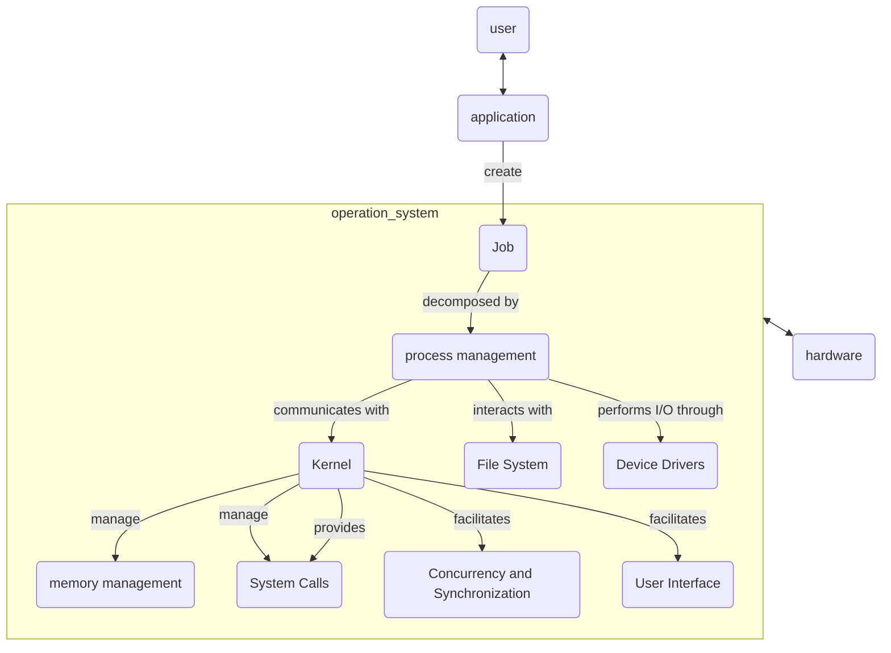

# Title

## Purpose

Understanding low-level computer operations is essential for computer engineering, software development, and information technology professionals to develop efficient software applications, manage computer systems, and enhance security against external threats.

## Concept

### Overview

Operating System serves as the communicator between computer hardware and computer software applications.

When a job or task is initiated from an application, the operating system's process management component handles the creation of a new process, allocating necessary resources through the kernel, managing memory and CPU usage, coordinating I/O operations through device drivers, and providing an interface for user interaction, all while ensuring the overall stability and efficiency of the system.

### memory management

Given processes in a computer, memory management checks how much memory to be allocated, what time to allocate the memory, and update the status of memory once some memory gets freed or unallocated. For more information, please refer to [process management](/blog/software/os/process-management).

### device management

In order to handle physical and virtual devices, device controller born in OS. Physical device includes all Input/Output devices and virtual devices mimics physical device in software, serving as device in system, making system to believe a particular hardware exists.

### file management

Recorded on secondary or non-volatile storage such as optical disks and used as medium for input and output of data.

### security

To prevent threats and attacks, several ways: regular OS patch updates, antivirus engines and software, firewall, stratification of authorization.

### performance monitoring

To optimize the OS, we need logs from performance monitoring for further optimization.

### job accounting

For tracking the time and resources used by various jobs and users.

### error detecting

Given noise in transmission of data, error detecting ensures reliable delivery of data by patching the data on time.

### coordination

Given lots of program at the sametime, OS corrdination serves to schedule these programs.

## Example

In this section, let's take a look at the above functions in operating systems and explore them with following steps:

1. user click an app on the computer UI
2. the app start to run and it need some computation
3. the data flow to operation system
4. operation system call hardware (CPU, RAM, I/O) to compute it
5. data sent back to OS
6. OS send data back to app
7. user get what they want in UI

### TODO

mac OS

## Reference

ChatGPT
